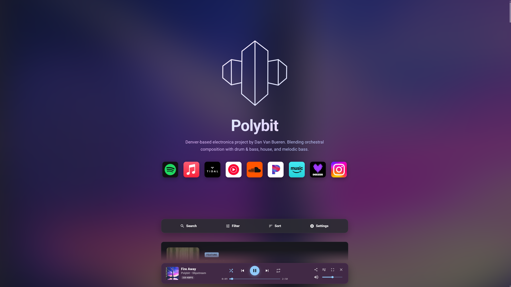
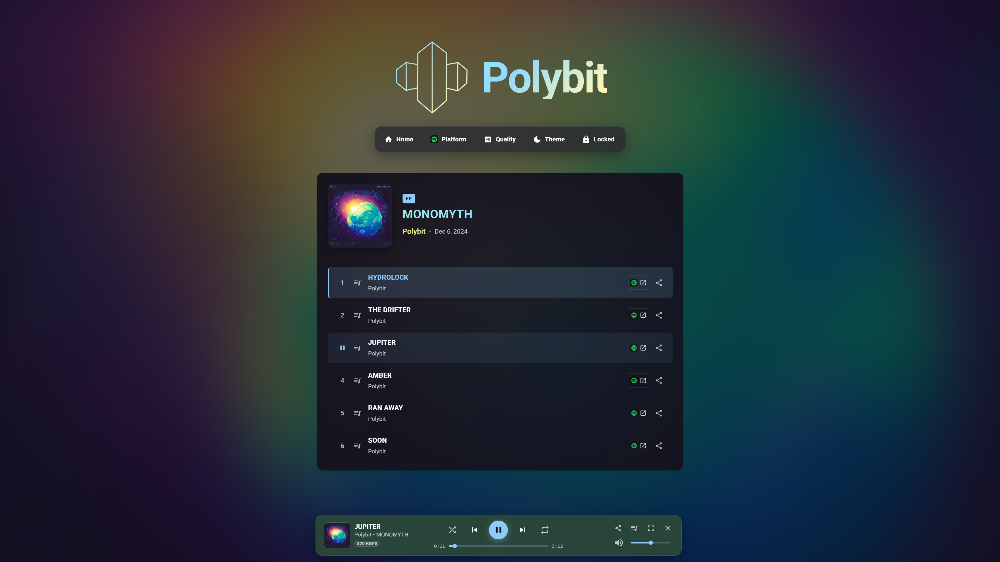
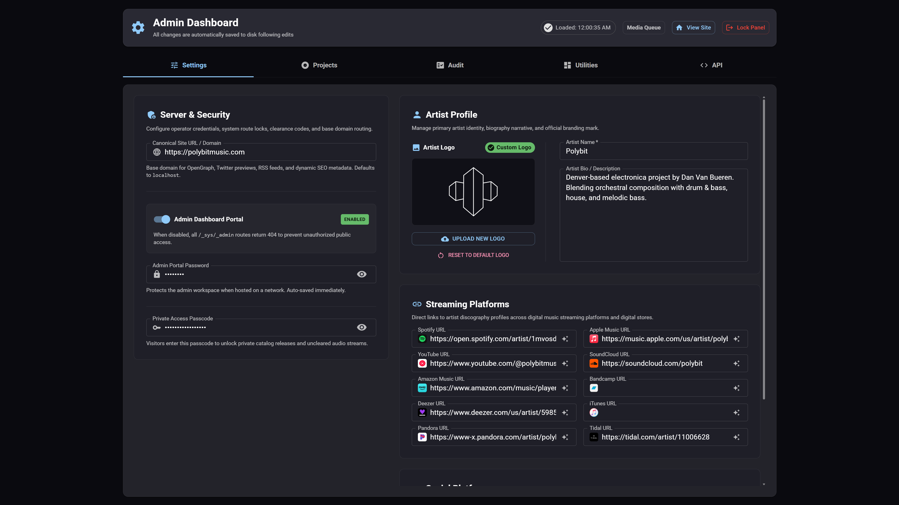

# [Artist Discography](https://github.com/danvanbueren/artist-discography) &middot; [](https://github.com/danvanbueren/artist-discography/blob/main/LICENSE) [](https://github.com/danvanbueren/artist-discography) [](https://github.com/danvanbueren/artist-discography/issues) [](https://github.com/danvanbueren/artist-discography/commits/main/)

A web app designed to showcase an artist's complete music discography, including albums, EPs, singles, and collaborations, with direct links to listen across all published streaming platforms.

## Sections

- [Quick Start](#quick-start)
- [Key Advantages](#key-advantages)
- [Showcase](#showcase)
- [Documentation](#documentation)
- [Tech Stack](#tech-stack)
- [Legal](#legal)

## Quick Start

**Clone this repo** to your local machine or server and set your present working directory to the repository root.

Choose your preferred deployment method below:

### 1. Local Deployment via Bun

> **Note:** Ensure [Bun](https://bun.sh/) is installed on the host.

```bash
# Change directory to the app folder
cd artist-discography

# Install dependencies
bun install

# Launch the development server
bun dev
```

Open [http://localhost:3000](http://localhost:3000) in your browser.

### 2. Containerized Deployment via Docker

> **Note:** Ensure [Docker](https://docs.docker.com/get-started/get-docker/) is installed on the host.

```bash
# Start the production stack in the background
docker compose up -d

# View live application logs
docker compose logs -f
```

Follow the [Deployment & DevOps Guide](./DEPLOYMENT.md) for more information.

## Key Advantages

🎧 **UX - Continuous Audio Playback, Instant Page Routing**
  - Built-in audio player with persistent playback across page navigation, network-agile multi-tier quality streaming, dynamic network probing, drag-and-drop queue management, integrated shuffle and repeat modes, and static keybind support for shortcuts. Continuous playback enabled by Single Page App architecture.

📱 **Integration - OS-Level Media Session, Wireless Casting**
  - Native lockscreen controls, hardware media keys, synchronized album artwork, and dual-engine wireless streaming via *Google Cast* and *Apple AirPlay*.

🔒 **Authentication - Per-Project Visibility & Gateable Access**
  - Hide unreleased projects, or maintain visibility but gate playback behind private access, ensuring precise discretionary visibility controls to public traffic.

🛡️ **Database - Modular Local Storage, Emphasis on Data Integrity**
  - Each release is isolated in its own folder under `data/projects/<slug>/` with atomic swap writes, automated rolling backups, corrupted file quarantine, and heuristic auto-repair.

🖼️ **Media - Progressive Audio & Image Delivery**
  - Sharp-powered dynamic image optimization, blur-up progressive images, non-blocking FFmpeg transcoding over SSE, background cache warming, and dynamic adaptive favicons.

🎛️ **Project Management - Unified Admin Dashboard**
  - Web-based release manager with track uploads, playlist drag-and-drop, link auto-search, OpenAPI 3.1 live explorer, and catalog health audits.

📊 **Analytics - Lightweight, Local & Privacy-Focused Metrics**
  - Built-in tracking of project streams, top tracks, page visits, and bandwidth usage stored in simple local JSON files (`data/analytics/`) with interactive timeline charts in the Admin Utilities tab.

🐳 **Deployment - Docker-, Cloudflare Tunnel-Ready**
  - Multi-stage production container with unprivileged user security, persistent host storage, and outbound encrypted Cloudflare Zero Trust tunnel support.

## Showcase

### Landing Page


### Project Page


### Admin Dashboard


## Documentation

All technical architecture blueprints, operational guides, and implementation plans are organized in the [`docs/`](./docs/) directory:

| Guide | Description |
| :--- | :--- |
| **[Overview](./docs/README.md)** | Central index and sitemap for all documentation. |
| **[Content Management](./docs/content-management.md)** | Complete guide to adding releases, configuring `data/config.json`, audio file specs, and cover artwork. |
| **[System Architecture](./docs/design/architecture-overview.md)** | Next.js 16 App Router SPA hybrid model, catch-all routing (`[[...slug]]`), and system route isolation. |
| **[Audio Playback](./docs/design/audio-engine.md)** | HTML5 audio element lifecycle, byte-range streaming, preloading, queue logic, casting, and OS MediaSession. |
| **[Media Pipeline & Caching](./docs/design/media-pipeline.md)** | Dynamic Sharp image processing, FFmpeg audio transcoding, cache warming, and dynamic favicons. |
| **[Data Storage & Resilience](./docs/design/data-storage-and-resilience.md)** | Zero-data-loss principles, atomic swap writes, rolling backups, and heuristic JSON recovery. |
| **[Security & Private Access](./docs/design/security-and-permissions.md)** | Private access passcodes, release visibility flags (`public`/`private`), and defense-in-depth API stream protection. |
| **[UI & Theme System](./docs/design/ui-and-theme-system.md)** | Obsidian glassmorphism design, Material UI 9 standards, and horizontal drag scrolling (`useDragScroll`). |
| **[API Reference](./docs/api-reference.md)** | Complete REST endpoint catalog and OpenAPI 3.1 live explorer guide. |
| **[Roadmap & Plans](./docs/plans/README.md)** | Engineering roadmap, future concepts, and archived milestone blueprints (Phases 1–14). |
| **[Deployment & DevOps](./DEPLOYMENT.md)** | End-to-end self-hosting guide with Docker, Cloudflare Zero Trust, domain setup, and permissions. |
| **[Development Standards](./AGENTS.md)** | Core code standards, MUI 9 guidelines, React hook rules, and contribution practices. |

## Tech Stack

> **Note:** Browse [package.json](./artist-discography/package.json) or [bun.lock](./artist-discography/bun.lock) for a comprehensive list of all dependencies and versions.

- **Deployment**
    - [Docker](https://www.docker.com/) ([docs](https://docs.docker.com/))
    - [Cloudflare Zero Trust](https://www.cloudflare.com/zero-trust/) ([docs](https://docs.cloudflare.com/en/zero-trust/))
    - [Bun](https://bun.sh/) ([docs](https://bun.sh/docs))
- **Frameworks**
    - [React](https://react.dev/) ([docs](https://react.dev/learn))
    - [Next.js](https://nextjs.org/) ([docs](https://nextjs.org/docs))
- **Styling**
    - [Material UI](https://mui.com/material-ui/) ([docs](https://mui.com/material-ui/getting-started/))
    - [Emotion](https://emotion.sh/docs/introduction) ([docs](https://emotion.sh/docs/introduction))
    - [Fontsource Roboto](https://fontsource.org/fonts/roboto) ([docs](https://fontsource.org/docs/getting-started/introduction))
    - [Day.js](https://day.js.org/) ([docs](https://day.js.org/docs/))
- **Media Processing**
    - [Sharp](https://sharp.pixelplumbing.com/) ([docs](https://sharp.pixelplumbing.com/docs/))
    - [FFmpeg](https://ffmpeg.org/) ([docs](https://ffmpeg.org/documentation.html))

## Legal
This project is licensed under the terms of the [LICENSE](./LICENSE) file.
