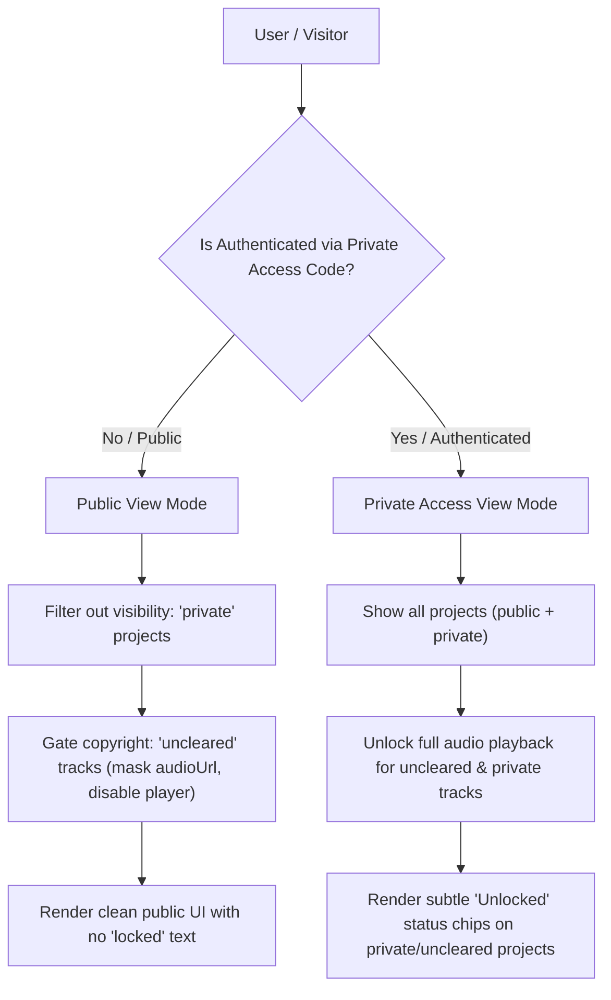

# Plan 05: Private Access System & Project Flags

## Status: ✅ **COMPLETED**

---

## 1. Verification Checklist & Status Log

- [x] Add `privateAccessCode` to `DEFAULT_DATA_SCAFFOLD` and `validateAndRepair` in `lib/artistData.js`.
- [x] Add `copyright` (`'cleared'` | `'uncleared'`, default: `'cleared'`) and `visibility` (`'public'` | `'private'`, default: `'public'`) properties to projects in `project.json` schema validation & disk persistence.
- [x] Update Admin Dashboard project editor (`ProjectEditForm.js` and `ProjectCreateForm.js`) to provide dropdown / selector controls for `visibility` and `copyright` flags.
- [x] Update Admin Dashboard artist profile (`ArtistProfileTab.js`) to display and configure `privateAccessCode` with show/hide password visibility toggle and random generator.
- [x] Create `PrivateAccessModal.js` authentication dialog with password input, authentication state checking, error shake / message, and logout / re-lock capability.
- [x] Add "Private Access" / "Unlocked" item to Settings menu in `FloatingNavBar.js` and `CompactArtistHeader.js`.
- [x] Implement client-side authentication persistence via secure cookie and `localStorage` (`authenticated_private_access = 'true'`).
- [x] Implement visibility filtering: When unauthenticated, projects with `visibility === 'private'` are completely hidden from discography views, search, type filters, and SPA routing.
- [x] Implement copyright playback gating:
  - When unauthenticated: projects with `copyright === 'uncleared'` display their cover, title, artist, date, and external streaming links normally, but in-site audio playback (`audioUrl`, play buttons) is disabled / masked.
  - Do NOT display any "locked" text or padlock icons to unauthenticated visitors.
  - When authenticated: audio playback is fully unlocked for uncleared tracks, and an elegant "Unlocked" chip / badge is displayed on project cards / headers.
- [x] Verify that entering an invalid private access code displays an error without reloading.
- [x] Verify that authenticating immediately updates state and renders private projects and uncleared audio without needing a hard page refresh.
- [x] Verify that logging out / re-locking immediately restores public-only filtering and pauses any currently playing uncleared audio.

---

## 2. Executive Summary & Problem Definition

Artists frequently host unreleased tracks, VIP edits, or demo projects that require private sharing with label reps or select fans via an access code. Furthermore, copyright regulations may prevent in-browser streaming of uncleared remixes or bootlegs while still allowing the artist to list official streaming links (or stream audio only to authorized listeners with the code).

### Core Goals:
1. **Private Access Code Configuration**: Stored in `data/config.json` (`privateAccessCode: "secret123"`).
2. **Project Visibility (`public` vs. `private`)**:
   - `public`: Always visible to everyone.
   - `private`: Completely hidden from the site (not rendered in discography, not in search, not in filters) unless authenticated with the private access code.
3. **Project Copyright (`cleared` vs. `uncleared`)**:
   - `cleared`: Full in-site audio playback enabled for all visitors.
   - `uncleared`: In-site audio playback is disabled for unauthenticated visitors (audio streams are withheld). All project metadata, artwork, and external streaming platform links remain visible. Unauthenticated users see no "locked" indicators. Authenticated users unlock full playback and see an "Unlocked" badge.

---

## 3. Architecture & Data Flow



---

## 4. Technical Specification & Implementation Plan

### A. Data Schema Extensions: [`lib/artistData.js`](file:///c:/Users/Dan/App%20Dev/artist-discography/artist-discography/lib/artistData.js)

1. Update `DEFAULT_DATA_SCAFFOLD`:
   ```javascript
   export const DEFAULT_DATA_SCAFFOLD = {
     adminAccess: true,
     adminPassword: 'admin123',
     devAccess: false,
     privateAccessCode: 'access123',
     // ...
     projects: [
       {
         name: '',
         type: '',
         artist: '',
         date: '',
         cover: '',
         visibility: 'public', // 'public' | 'private'
         copyright: 'cleared', // 'cleared' | 'uncleared'
         tracks: [ ... ]
       }
     ]
   }
   ```
2. In `ArtistDataManager.validateAndRepair()`:
   - Validate `data.privateAccessCode` (string, defaults to `''`).
   - For each project:
     - `proj.visibility = (proj.visibility === 'private') ? 'private' : 'public'`
     - `proj.copyright = (proj.copyright === 'uncleared') ? 'uncleared' : 'cleared'`

### B. Admin Dashboard Controls

1. **Project Editor**: [`components/admin/projects/ProjectEditForm.js`](file:///c:/Users/Dan/App%20Dev/artist-discography/artist-discography/components/admin/projects/ProjectEditForm.js) & [`ProjectCreateForm.js`](file:///c:/Users/Dan/App%20Dev/artist-discography/artist-discography/components/admin/projects/ProjectCreateForm.js)
   - Add a "Visibility & Copyright Settings" section with two responsive `<FormControl>` dropdowns:
     - **Visibility**: `Public (Visible to all)` / `Private (Hidden unless authenticated with access code)`
     - **Copyright Status**: `Cleared (In-site streaming enabled)` / `Uncleared (Streaming restricted to access code)`
   - Add status chips in the project header reflecting the current visibility and copyright status.

2. **Artist Profile & Settings Tab**: [`components/admin/profile/ArtistProfileTab.js`](file:///c:/Users/Dan/App%20Dev/artist-discography/artist-discography/components/admin/profile/ArtistProfileTab.js)
   - Add "Private Access Configuration" card.
   - Field: `privateAccessCode` with show/hide password toggle, description, and "Generate Random Code" helper button.

### C. Private Access Authentication Modal: [`components/auth/PrivateAccessModal.js`](file:///c:/Users/Dan/App%20Dev/artist-discography/artist-discography/components/auth/PrivateAccessModal.js)

- Responsive Dialog with smooth entry transition:
  - Input field for entering the access code.
  - Submit button ("Unlock Access").
  - Client authentication handler verifying against `data.privateAccessCode` (or via server API check `/api/auth/private-access`).
  - If authenticated:
    - Stores `authenticated_private_access = 'true'` in `localStorage` and a cookie `private_access_auth=true`.
    - Displays current status ("Private Access Unlocked").
    - Provides a "Lock / Sign Out" button to clear authentication.
  - Toast feedback upon successful authentication / lock.

### D. Client-Side Filtering & Playback Gating: [`components/discography/MainDiscographyApp.js`](file:///c:/Users/Dan/App%20Dev/artist-discography/artist-discography/components/discography/MainDiscographyApp.js)

1. State Initialization:
   ```javascript
   const [isPrivateAuthenticated, setIsPrivateAuthenticated] = useState(() => {
     if (typeof window === 'undefined') return false
     return localStorage.getItem('authenticated_private_access') === 'true' ||
            getCookie('private_access_auth') === 'true'
   })
   ```
2. Dynamic Project Sanitization & Derivation:
   ```javascript
   const processedProjects = useMemo(() => {
     return (data?.projects ?? []).filter(proj => {
       if (proj.visibility === 'private' && !isPrivateAuthenticated) {
         return false
       }
       return true
     }).map(proj => {
       const isUnclearedGated = proj.copyright === 'uncleared' && !isPrivateAuthenticated
       if (isUnclearedGated) {
         return {
           ...proj,
           tracks: (proj.tracks || []).map(t => ({
             ...t,
             hasAudio: false,
             audioUrl: null,
             isPlaybackGated: true,
           }))
         }
       }
       return {
         ...proj,
         isUnlockedPrivate: proj.visibility === 'private' && isPrivateAuthenticated,
         isUnlockedUncleared: proj.copyright === 'uncleared' && isPrivateAuthenticated,
       }
     })
   }, [data?.projects, isPrivateAuthenticated])
   ```
3. UI Indicators:
   - When `isUnlockedPrivate` or `isUnlockedUncleared` is true, render a subtle Chip (`<Chip icon={<LockOpenRoundedIcon />} label="Unlocked" size="small" color="primary" />`) on `ProjectHeader.js` and `ProjectCard.js`.
   - When unauthenticated: zero mention of "locked" or "restricted", presenting a clean, natural streaming-links-only card for uncleared projects.

---

## 5. Edge Cases & Error Handling

1. **Direct Slug Navigation to Private Project**: If an unauthenticated user enters `/private-project-slug` in the browser address bar, `syncStateFromLocation` will fail to find the project in `processedProjects` and gracefully fallback to the main view (`/`) without crashing or exposing data.
2. **Revoking Access**: Clicking "Lock / Logout" in the Settings modal immediately clears the auth cookie/localStorage, stops any currently playing audio from an uncleared track, and cleans the active queue.
3. **Empty / Disabled Access Code**: If `privateAccessCode` is blank or unconfigured in `artist-data.json`, private access modal prompts user that no private access code is set.
