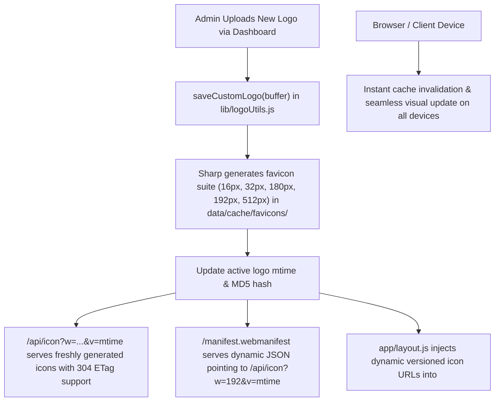

# Plan 06: Media Delivery Reliability & Dynamic Favicon Suite

## Status: ✅ **COMPLETED**

---

## 1. Verification Checklist & Status Log

- [x] Audit all media delivery endpoints (`/api/logo`, `/api/icon`, `/api/media/[...path]`, `/api/audio/[...path]`).
- [x] Implement automated favicon suite generation in `lib/logoUtils.js` using Sharp:
  - `favicon-16.png` (16x16)
  - `favicon-32.png` (32x32)
  - `favicon-48.png` (48x48)
  - `apple-touch-icon.png` (180x180)
  - `icon-192.png` (192x192)
  - `icon-512.png` (512x512)
- [x] Store generated favicon assets in `data/cache/favicons/` keyed by size and logo mtime.
- [x] Enhance `/api/icon/route.js` to accept width/size parameters (`?w=16`, `?w=32`, `?w=180`, `?w=192`, `?w=512`) and dynamically serve the appropriate pre-rendered or transcoded favicon PNG from the active artist logo.
- [x] Create dynamic Web App Manifest endpoint at `app/manifest.webmanifest/route.js` that dynamically resolves active artist name, description, theme colors, and dynamic icon URLs with cache-busting version parameters (`/api/icon?w=192&v=${logoMtime}`).
- [x] Update `app/layout.js` metadata to use dynamic versioned favicon and manifest URLs (`/api/icon?w=32&v=${logoMtime}`, `/api/icon?w=180&v=${logoMtime}`, `/manifest.webmanifest?v=${logoMtime}`).
- [x] Fix HTTP caching headers on `/api/logo` and `/api/icon`:
  - When custom logo is active: `Cache-Control: public, max-age=60, stale-while-revalidate=300` with strong `ETag` and `Last-Modified` headers.
  - Browser query params `?v=${mtime}` force immediate cache eviction across all browsers and devices when a new logo is uploaded.
- [x] Implement explicit cache purge and automated cache cleaner trigger on custom logo upload (`saveCustomLogo`) and deletion (`deleteCustomLogo`).
- [x] Verify that uploading a new logo in the Admin Dashboard instantly updates the site header logo, favicon, Apple touch icon, and PWA manifest across multiple test browsers without waiting 24+ hours or requiring manual browser cache clearing.
- [x] Verify album art and social platform icon delivery with conditional GET (`If-None-Match` -> `304 Not Modified`).

---

## 2. Executive Summary & Root Cause Analysis

### Identified Issues:
1. **Logo Update Lag**: When a custom logo is uploaded, browser HTTP caches and Next.js static asset loaders hold onto stale cached images because URLs lacked dynamic modification timestamp cache-busters (`?v=${mtime}`).
2. **Favicon & Web App Manifest Disconnect**:
   - `public/favicons/manifest.json` hardcoded static image paths (`/favicons/web-app-manifest-192x192.png`, etc.) that were never rebuilt or updated when a custom logo was saved.
   - `app/layout.js` referenced `/favicons/manifest.json` statically, causing mobile home-screen installs and bookmarks to display default placeholder logos rather than the uploaded artist brand.
   - Browsers cache `/favicon.ico` aggressively (often for months) unless forced to invalidate via query strings or dynamic routes.

---

## 3. Architecture & Delivery Pipeline



---

## 4. Technical Specification & Implementation Plan

### A. Favicon Generation Suite: [`lib/logoUtils.js`](file:///c:/Users/Dan/App%20Dev/artist-discography/artist-discography/lib/logoUtils.js)

1. Use Sharp to generate standard favicon and PWA icon sizes upon upload:
   ```javascript
   import sharp from 'sharp'
   
   const FAVICON_SIZES = [
     { size: 16, name: 'favicon-16.png' },
     { size: 32, name: 'favicon-32.png' },
     { size: 48, name: 'favicon-48.png' },
     { size: 180, name: 'apple-touch-icon.png' },
     { size: 192, name: 'icon-192.png' },
     { size: 512, name: 'icon-512.png' },
   ]
   
   export async function generateFaviconSuite(logoBuffer) {
     const faviconsDir = path.join(process.cwd(), 'data', 'cache', 'favicons')
     if (!fs.existsSync(faviconsDir)) {
       fs.mkdirSync(faviconsDir, { recursive: true })
     }
     
     const results = {}
     for (const { size, name } of FAVICON_SIZES) {
       const destPath = path.join(faviconsDir, name)
       await sharp(logoBuffer)
         .resize(size, size, { fit: 'contain', background: { r: 0, g: 0, b: 0, alpha: 0 } })
         .png({ quality: 90, compressionLevel: 9 })
         .toFile(destPath)
       results[size] = destPath
     }
     return results
   }
   ```
2. Integrate with `saveCustomLogo()`:
   - Call `await generateFaviconSuite(buffer)` immediately after saving `data/logo.<ext>`.
   - Call `scheduleAutomatedCachePrune(5000)` to clear old cache files.
3. In `deleteCustomLogo()`:
   - Purge `data/cache/favicons/` to revert to default fallback assets in `public/favicons/`.

### B. Dynamic Icon Endpoint: [`app/api/icon/route.js`](file:///c:/Users/Dan/App%20Dev/artist-discography/artist-discography/app/api/icon/route.js)

1. Read `?w=` query parameter (e.g. `16`, `32`, `180`, `192`, `512`).
2. If size is requested, serve the corresponding generated icon from `data/cache/favicons/` (or generate on-the-fly with Sharp and cache in memory).
3. If no size is requested, serve the 32x32 favicon or native SVG/PNG icon.
4. ETag generation:
   `ETag: W/"icon-${size}-${logoDetails.mtimeMs.toString(16)}"`
5. Cache-Control:
   `public, max-age=300, stale-while-revalidate=86400`
6. `If-None-Match` header check returns `304 Not Modified` with zero body.

### C. Dynamic Web App Manifest Endpoint: [`app/manifest.webmanifest/route.js`](file:///c:/Users/Dan/App%20Dev/artist-discography/artist-discography/app/manifest.webmanifest/route.js)

1. Load artist data and logo details dynamically on request.
2. Output valid `application/manifest+json`:
   ```json
   {
     "name": "${artistName} Discography",
     "short_name": "${artistName}",
     "description": "${artistBio}",
     "start_url": "/",
     "display": "standalone",
     "background_color": "#0a0a0f",
     "theme_color": "#12121a",
     "icons": [
       {
         "src": "/api/icon?w=192&v=${logoMtime}",
         "sizes": "192x192",
         "type": "image/png",
         "purpose": "any maskable"
       },
       {
         "src": "/api/icon?w=512&v=${logoMtime}",
         "sizes": "512x512",
         "type": "image/png",
         "purpose": "any maskable"
       }
     ]
   }
   ```

### D. Layout Dynamic Metadata Injection: [`app/layout.js`](file:///c:/Users/Dan/App%20Dev/artist-discography/artist-discography/app/layout.js)

1. Read `getLogoDetails()` inside `generateMetadata()`:
   ```javascript
   const logoDetails = getLogoDetails()
   const logoVersion = logoDetails.mtimeMs ? Math.floor(logoDetails.mtimeMs) : '1'
   
   return {
     // ...
     icons: {
       icon: [
         { url: `/api/icon?w=32&v=${logoVersion}`, sizes: '32x32', type: 'image/png' },
         { url: `/api/icon?w=16&v=${logoVersion}`, sizes: '16x16', type: 'image/png' },
       ],
       shortcut: `/api/icon?w=32&v=${logoVersion}`,
       apple: `/api/icon?w=180&v=${logoVersion}`,
     },
     manifest: `/manifest.webmanifest?v=${logoVersion}`,
   }
   ```

---

## 5. Edge Cases & Safeguards

1. **Non-Square or Large Logo Uploads**: Sharp's `fit: 'contain'` with transparent padding guarantees that non-square artist logos are perfectly centered without distortion or cropping.
2. **Missing Logo / First Run**: If no custom logo exists, seamlessly fall back to `public/favicons/` default icons.
3. **SVG Logos**: Special branch to deliver raw vector SVG with `image/svg+xml` for crisp vector rendering in modern desktop browsers while rasterizing to PNG for Apple touch and Android Chrome manifests.
