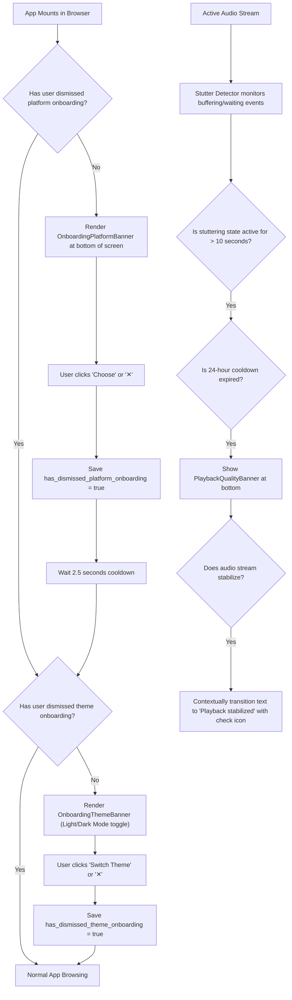

# Plan 08: Navigation, Projects Page UI & Onboarding Banners

## Status: ✅ **COMPLETED**

---

## 1. Verification Checklist & Status Log

- [x] **Projects Page Back Button Indicator**:
  - Open any project page (e.g. `/post-mortem` or `/post-mortem/rest`).
  - Verify the top Artist Logo & Name header features a clear visual back-to-home indicator (e.g. an `ArrowBackRoundedIcon` or `HomeRoundedIcon` badge/icon button or clear CTA button).
  - Hovering and clicking smoothly navigates back to the main discography (`/`) without page reload.
- [x] **New User Onboarding Platform Banner**:
  - Open site in an incognito / fresh browser window (no existing cookies/localStorage).
  - Verify a simple, colorful, floating one-liner banner appears at the bottom of the screen above the content.
  - Banner includes:
    - Material platform icon (e.g. `HeadphonesRoundedIcon` or `LinkRoundedIcon`)
    - Concise copy: "Choose your preferred streaming platform for quick one-click listening"
    - Primary CTA Button: "Choose Platform" (immediately opens `PlatformSelectorModal`)
    - Dismiss "✕" button
  - Click "Choose Platform" or dismiss "✕".
  - Verify banner closes and is permanently stored in `localStorage` (`has_dismissed_platform_onboarding = 'true'`), never reappearing on subsequent reloads.
- [x] **Sequential Theme / Color Mode Onboarding Banner**:
  - After the Platform Onboarding dialog/banner is handled (either chosen or dismissed), wait ~2-3 seconds.
  - If the user has not yet dismissed the theme banner (`has_dismissed_theme_onboarding !== 'true'`), display a floating color theme onboarding banner in the same style.
  - Banner includes:
    - Material icon (e.g. `DarkModeRoundedIcon` / `LightModeRoundedIcon` / `PaletteRoundedIcon`)
    - Concise copy: dynamic subtitle reflecting active mode (e.g. "Switch between dark and light theme to match your listening aesthetic.")
    - Primary CTA Button: "Switch to Light Mode" / "Switch to Dark Mode" (toggles theme immediately and dismisses banner)
    - Dismiss "✕" button
  - Click CTA or dismiss "✕".
  - Verify banner closes and is permanently stored in `localStorage` (`has_dismissed_theme_onboarding = 'true'`).
- [x] **Enhanced Audio Playback Quality Guidance Toast/Banner**:
  - Simulate slow network or playback stutter where quality pill turns yellow.
  - If the yellow buffering/stuttering state persists continuously for > 10 seconds, display a floating one-liner guidance toast at the bottom of the screen.
  - Toast suggests lowering audio quality (e.g. to 128k or 192k) with a 1-click CTA button opening `AudioQualityModal`.
  - Cooldown logic: track the last dismissal timestamp in `localStorage` (`last_quality_banner_dismissed_at`) so users are not spammed (suppress for 24 hours after dismissal or manual quality selection).
  - Context-aware recovery: if the stream recovers and stops stuttering while the toast is visible, dynamically update the text and color styling ("Audio playback stabilized — tap to change quality anytime") without closing abruptly or shifting layout.
- [x] Verify banner z-indexes float above content without obstructing playback bar controls.

---

## 2. Executive Summary & Design Standards

### Core Objectives:
1. **Clear Project-to-Home Affordance**: Users who land directly on a single project page (`/[project-slug]`) from external links frequently miss that the artist name and logo is clickable. Adding an explicit back arrow or home indicator removes ambiguity.
2. **First-Time Visitor Platform & Theme Onboarding Sequence**: Prompts users first to select their preferred service (Spotify, Apple Music, YouTube, SoundCloud, etc.), and once handled, waits a couple seconds to introduce light/dark mode aesthetic selection.
3. **Graceful Quality Degradation Guidance**: Rather than letting audio repeatedly buffer when a listener is on a poor mobile connection, guide them gently to switch from 320k/Lossless to 128k/192k with a smart, cooldown-limited banner.

---

## 3. Architecture & State Coordination



---

## 4. Technical Specification & Implementation Plan

### A. Projects Page Header Indicator: [`components/layout/CompactArtistHeader.js`](file:///c:/Users/Dan/App%20Dev/artist-discography/artist-discography/components/layout/CompactArtistHeader.js)

1. Add an elevated back button / visual indicator to the clickable header container:
   ```jsx
   <Stack
     direction="row"
     spacing={{ xs: 1.5, sm: 2 }}
     onClick={onNavigateHome}
     sx={{
       alignItems: 'center',
       justifyContent: 'center',
       cursor: 'pointer',
       px: { xs: 2.5, sm: 4 },
       py: { xs: 1.5, sm: 2 },
       borderRadius: 4,
       bgcolor: isDarkMode ? 'rgba(255,255,255,0.04)' : 'rgba(0,0,0,0.03)',
       border: '1px solid',
       borderColor: isDarkMode ? 'rgba(255,255,255,0.1)' : 'rgba(0,0,0,0.08)',
       transition: 'all 0.25s ease',
       '&:hover': {
         bgcolor: isDarkMode ? 'rgba(255,255,255,0.08)' : 'rgba(0,0,0,0.06)',
         borderColor: 'primary.main',
         transform: 'scale(1.02)',
       },
     }}
   >
     <Tooltip title="Return to All Projects" arrow>
       <Box
         sx={{
           display: 'flex',
           alignItems: 'center',
           justifyContent: 'center',
           width: { xs: 32, sm: 38 },
           height: { xs: 32, sm: 38 },
           borderRadius: '50%',
           bgcolor: 'primary.main',
           color: 'primary.contrastText',
           mr: { xs: 1, sm: 1.5 },
           flexShrink: 0,
         }}
       >
         <ArrowBackRoundedIcon sx={{ fontSize: { xs: 18, sm: 22 } }} />
       </Box>
     </Tooltip>
     
     {/* Logo & Artist Title */}
     <Box component="img" src="/api/logo?w=96&fmt=webp" alt="Artist Logo" ... />
     <Typography variant="h3" fontWeight={800}>
       {name || 'Artist'}
     </Typography>
   </Stack>
   ```

### B. New User Onboarding Banner: [`components/discography/OnboardingPlatformBanner.js`](file:///c:/Users/Dan/App%20Dev/artist-discography/artist-discography/components/discography/OnboardingPlatformBanner.js)

1. Floating toast container anchored to bottom of viewport (above sticky audio player when visible):
   ```jsx
   export default function OnboardingPlatformBanner({ onOpenPlatformModal, isPlayerOpen = false }) {
     const [visible, setVisible] = useState(false)
     
     useEffect(() => {
       const dismissed = localStorage.getItem('has_dismissed_platform_onboarding') === 'true'
       if (!dismissed) {
         const timer = setTimeout(() => setVisible(true), 1200)
         return () => clearTimeout(timer)
       }
     }, [])
     
     const handleDismiss = () => {
       setVisible(false)
       try {
         localStorage.setItem('has_dismissed_platform_onboarding', 'true')
       } catch {}
     }
     
     const handleOpen = () => {
       handleDismiss()
       if (onOpenPlatformModal) onOpenPlatformModal()
     }
     
     return (
       <Slide direction="up" in={visible} mountOnEnter unmountOnExit>
         <Paper
           elevation={8}
           sx={{
             position: 'fixed',
             bottom: isPlayerOpen ? { xs: 80, sm: 100 } : { xs: 16, sm: 24 },
             left: '50%',
             transform: 'translateX(-50%) !important',
             zIndex: 1150,
             maxWidth: 'min(92vw, 540px)',
             width: '100%',
             borderRadius: 3.5,
             p: { xs: 1.5, sm: 2 },
             bgcolor: theme => theme.palette.mode === 'dark' ? '#1c1c28' : '#ffffff',
             border: '1px solid',
             borderColor: 'primary.main',
             boxShadow: '0 12px 36px rgba(0,0,0,0.4)',
             display: 'flex',
             alignItems: 'center',
             gap: 1.5,
           }}
         >
           <HeadphonesRoundedIcon color="primary" sx={{ fontSize: 28, flexShrink: 0 }} />
           <Box sx={{ flexGrow: 1, minWidth: 0 }}>
             <Typography variant="subtitle2" fontWeight={700} lineHeight={1.2}>
               Select Preferred Platform
             </Typography>
             <Typography variant="caption" color="text.secondary" noWrap sx={{ display: 'block' }}>
               Quickly open music on your favorite streaming service.
             </Typography>
           </Box>
           <Button size="small" variant="contained" onClick={handleOpen} sx={{ borderRadius: 2, flexShrink: 0, textTransform: 'none', fontWeight: 700 }}>
             Choose
           </Button>
           <IconButton size="small" onClick={handleDismiss} sx={{ color: 'text.secondary', p: 0.5 }}>
             <CloseRoundedIcon fontSize="small" />
           </IconButton>
         </Paper>
       </Slide>
     )
   }
   ```

### C. Playback Quality Guidance Banner: [`components/player/PlaybackQualityBanner.js`](file:///c:/Users/Dan/App%20Dev/artist-discography/artist-discography/components/player/PlaybackQualityBanner.js)

1. Stuttering Duration Tracking:
   - Starts a 10-second timer when `isStuttering` turns `true`.
   - If `isStuttering` remains true at 10s AND 24-hour cooldown has elapsed, reveal banner.
   - If stuttering ends while banner is open: update styling from warning amber (`#fbbf24`) to success/info blue (`primary.main`) with text `"Audio playback stabilized — tap to adjust quality"`.
2. Cooldown Persistence:
   - On close or manual quality change: store `Date.now()` in `localStorage.getItem('last_quality_banner_dismissed_at')`.

---

## 5. Edge Cases & Safeguards

1. **Mobile Layout Overlap**: Ensure `bottom` offset dynamically adjusts depending on whether `AudioPlayerBar` is expanded or collapsed.
2. **Local Storage Unavailable**: Guard all `localStorage` reads/writes with `try/catch` to support private browsing modes with disabled cookies.
