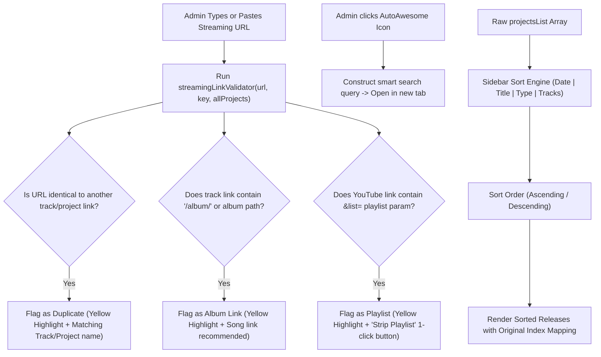

# Plan 10: Admin Dashboard Streaming Links & Sidebar Sorting Power Tools

## Status: ✅ **COMPLETED**

---

## 1. Verification Checklist & Status Log

- [x] **AutoAwesome Search Helper Button**:
  - Add `<AutoAwesomeIcon>` IconButton as an end-adornment on every streaming link input in `TrackEditCard.js`, `TrackCreateCard.js`, and `ArtistProfileTab.js`.
  - Clicking the icon opens a targeted search query in a new browser tab for that specific platform (e.g. searching Google / Spotify / YouTube for `"<track artist> <track name> <platform>"`).
  - Include platform-specific direct URL search schemas (e.g. YouTube search `https://www.youtube.com/results?search_query=...`, Spotify search, etc.) with Google fallback.
- [x] **Duplicate Streaming Link Detection**:
  - Implement multi-tiered link validation in `TrackEditCard.js`, `TrackCreateCard.js`, and `adminUtils.js`.
  - Performs prioritized searches:
    1. **Cross-Project (Primary)**: Detects matches across all other projects in the discography (`"⚠️ Duplicate link: matches Track '<trk>' in Project '<proj>' (<platform>)"`).
    2. **Intra-Project (Secondary)**: Detects matches across all other tracks within the current project (`"⚠️ Duplicate link: matches Track '<trk>' (<platform>) in this project"`).
    3. **Intra-Track (Tertiary)**: Detects when a URL is accidentally pasted across multiple platform fields on the exact same track (`"⚠️ Duplicate link: already pasted in <platform> on this track"`).
  - Highlights the input in warning amber (`warning.main`) with contextual feedback.
- [x] **Album Link Warning on Track Fields**:
  - Detect if a track streaming link contains `/album/`, `album`, or album URI schemes (e.g. `open.spotify.com/album/...` or `music.apple.com/.../album/...` without a `?i=` track ID).
  - Highlight the field in warning yellow.
  - Display helpful feedback: `"⚠️ Detected album link. A direct track/song link is strongly recommended."`.
- [x] **YouTube Playlist Link Cleaner**:
  - Detect if a YouTube link contains playlist parameters (e.g. `&list=...`, `&index=...`, `/playlist?list=...`).
  - Highlight the field yellow with explanation: `"⚠️ YouTube playlist link detected. Direct video link is preferred."`.
  - Provide an inline text button (`"Clean URL"`) right below the input that immediately strips playlist query parameters, leaving the clean direct video URL (`https://www.youtube.com/watch?v=ia6Egus_6mg`).
- [x] **Admin Manage Projects Sidebar Dynamic Sorting**:
  - In `ProjectSidebarList.js`, enhance the "Existing Releases" column with intuitive sorting controls.
  - Automatically default the display order to **Chronological (Date: Newest First)** without altering the underlying JSON file array order.
  - Support multiple sort criteria:
    - **Date** (Newest First / Oldest First)
    - **Alphabetical** (Title A &rarr; Z / Z &rarr; A)
    - **Release Type** (LP, EP, Single, Remix, etc.)
    - **Track Count** (Most Tracks / Fewest Tracks)
    - **Original JSON Order** (Raw file index)
  - Provide an intuitive Direction Toggle Button (Ascending / Descending) with dynamic icon (`ArrowDownwardRoundedIcon` / `ArrowUpwardRoundedIcon`).
  - Selecting a project from the sorted list maps back seamlessly to its absolute index in `projectsList` so editing and saving never misaligns target projects.
- [x] Verify that all warnings are non-blocking (they guide the admin without preventing saving).

---

## 2. Executive Summary & Administrative UX Goals

Managing discography metadata across dozens of streaming platforms is error-prone. Admins frequently copy the wrong link, copy album links instead of track links, or leave unwanted playlist parameters attached to YouTube URLs. Additionally, large discographies with 20+ releases become difficult to manage when projects are listed in arbitrary creation order rather than sorted chronologically or alphabetically.

### Core Tools Added:
1. **Magic Search (`AutoAwesomeIcon`)**: Instantly searches the internet or specific platform for the exact track and artist name.
2. **Duplicate Link Watchdog**: Scans across the entire discography and points directly to the matching project and track when a duplicate URL is pasted.
3. **Album Link Guardian**: Alerts the admin if an album URL was mistakenly pasted into a song field.
4. **YouTube URL Cleaner**: One-click inline utility to strip `&list=...` and `&index=...` parameters from YouTube links.
5. **Dynamic Sidebar Sorting Controls**: Compact sort selector allowing admins to browse their releases by Date, Title, Type, or Track Count in Ascending/Descending order while keeping JSON storage pristine.

---

## 3. Architecture & Data Flow



---

## 4. Technical Specification & Implementation Plan

### A. Sidebar Dynamic Sorting Implementation: [`components/admin/projects/ProjectSidebarList.js`](file:///c:/Users/Dan/App%20Dev/artist-discography/artist-discography/components/admin/projects/ProjectSidebarList.js)

```javascript
// Sort state in ProjectSidebarList or useProjectsManager
const [sidebarSortBy, setSidebarSortBy] = useState('date') // 'date' | 'title' | 'type' | 'tracks' | 'json'
const [sidebarSortAsc, setSidebarSortAsc] = useState(false) // false = newest/Z-A, true = oldest/A-Z

// Compute sorted items with original index mapping
const sortedProjectsWithIndex = useMemo(() => {
  const indexed = projectsList.map((project, originalIndex) => ({
    project,
    originalIndex,
  }))

  return indexed.sort((a, b) => {
    if (sidebarSortBy === 'json') {
      return sidebarSortAsc ? a.originalIndex - b.originalIndex : b.originalIndex - a.originalIndex
    }

    if (sidebarSortBy === 'date') {
      const dateA = a.project.date ? new Date(a.project.date).getTime() : 0
      const dateB = b.project.date ? new Date(b.project.date).getTime() : 0
      return sidebarSortAsc ? dateA - dateB : dateB - dateA
    }

    if (sidebarSortBy === 'title') {
      const titleA = (a.project.name || '').toLowerCase()
      const titleB = (b.project.name || '').toLowerCase()
      return sidebarSortAsc ? titleA.localeCompare(titleB) : titleB.localeCompare(titleA)
    }

    if (sidebarSortBy === 'type') {
      const typeA = (a.project.type || '').toLowerCase()
      const typeB = (b.project.type || '').toLowerCase()
      return sidebarSortAsc ? typeA.localeCompare(typeB) : typeB.localeCompare(typeA)
    }

    if (sidebarSortBy === 'tracks') {
      const countA = a.project.tracks?.length || 0
      const countB = b.project.tracks?.length || 0
      return sidebarSortAsc ? countA - countB : countB - countA
    }

    return 0
  })
}, [projectsList, sidebarSortBy, sidebarSortAsc])
```

### B. Header Sorting UI Controls:
```jsx
<Box sx={{ display: 'flex', alignItems: 'center', justifyContent: 'space-between', mb: 1.5, gap: 1 }}>
  <Typography variant="subtitle2" sx={{ fontWeight: 700, color: 'text.secondary', whiteSpace: 'nowrap' }}>
    Releases ({projectsList.length})
  </Typography>
  
  <Stack direction="row" spacing={0.5} sx={{ alignItems: 'center' }}>
    <Select
      size="small"
      value={sidebarSortBy}
      onChange={(e) => setSidebarSortBy(e.target.value)}
      sx={{
        height: 28,
        fontSize: '0.75rem',
        borderRadius: 1.5,
        '& .MuiSelect-select': { py: 0.5, px: 1 },
      }}
    >
      <MenuItem value="date">Date</MenuItem>
      <MenuItem value="title">Title</MenuItem>
      <MenuItem value="type">Type</MenuItem>
      <MenuItem value="tracks">Tracks</MenuItem>
      <MenuItem value="json">Raw Order</MenuItem>
    </Select>

    <Tooltip title={sidebarSortAsc ? "Ascending" : "Descending"} arrow>
      <IconButton
        size="small"
        onClick={() => setSidebarSortAsc((prev) => !prev)}
        sx={{ p: 0.5, color: 'text.secondary' }}
      >
        {sidebarSortAsc ? <ArrowUpwardRoundedIcon fontSize="small" /> : <ArrowDownwardRoundedIcon fontSize="small" />}
      </IconButton>
    </Tooltip>
  </Stack>
</Box>
```

### C. Streaming Link Utilities: [`components/admin/adminUtils.js`](file:///c:/Users/Dan/App%20Dev/artist-discography/artist-discography/components/admin/adminUtils.js)
- `findDuplicateLink()`
- `isAlbumLevelUrl()`
- `analyzeYouTubeUrl()`
- `buildPlatformSearchUrl()`

---

## 5. Edge Cases & Safeguards

1. **Mapping Preserved**: Clicking a sorted release card invokes `handleSelectProject(originalIndex)`, ensuring the edit form operates on the exact array element.
2. **Missing Dates**: Projects with empty/invalid dates fallback safely to `0` timestamp during date comparison without crashing.
