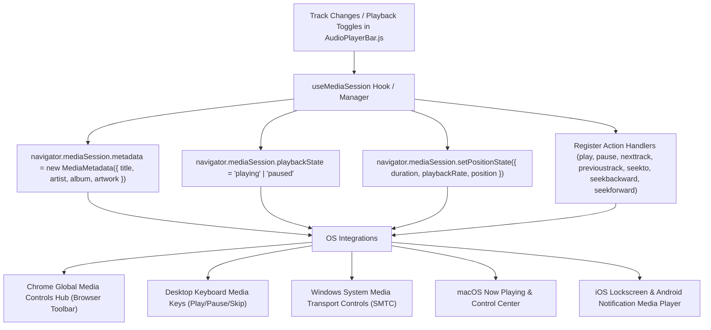

# Plan 11: OS Media Session & Hardware Key Controls

## Status: ✅ **COMPLETED**

---

## 1. Verification Checklist & Status Log

- [x] Verify `navigator.mediaSession` support detection in browser/environment.
- [x] Create a dedicated hook or manager (`lib/hooks/useMediaSession.js` or integration in `AudioPlayerBar.js`) to sync HTML5 `<audio>` playback state with the OS Media Session API.
- [x] Implement `MediaMetadata` with complete artist discography context:
  - `title`: Track title (`playingTrack.name`)
  - `artist`: Track artist (`playingTrack.artist || playingTrack.projectArtist || artist.name`)
  - `album`: Project name (`playingTrack.project || 'Discography'`)
  - `artwork`: Responsive multi-resolution artwork array (`96x96`, `128x128`, `192x192`, `256x256`, `384x384`, `512x512`) pointing to `/api/media/...` or `/api/logo` with proper MIME types.
- [x] Register all standard Media Session Action Handlers:
  - `play`: invokes `handleDirectTogglePlay()` or `onTogglePlay()`
  - `pause`: invokes `handleDirectTogglePlay()` or `onTogglePlay()`
  - `previoustrack`: invokes `onSkipPrev()`
  - `nexttrack`: invokes `onSkipNext()`
  - `seekbackward`: seeks backward by 10 seconds (`currentTime - 10`)
  - `seekforward`: seeks forward by 10 seconds (`currentTime + 10`)
  - `seekto`: seeks to exact timestamp when scrubbing via OS controls (`details.seekTime`)
  - `stop`: pauses audio and unloads media session
- [x] Implement `navigator.mediaSession.playbackState`:
  - Dynamically set to `'playing'` when audio is actively playing.
  - Dynamically set to `'paused'` when audio is paused.
  - Dynamically set to `'none'` when player is dismissed or unmounted.
- [x] Implement `navigator.mediaSession.setPositionState()`:
  - Keep OS scrub bars (Windows Media Flyout, macOS Control Center, Android Notification, iOS Lockscreen, Chrome Global Media Controls) in sync with `duration`, `playbackRate: 1`, and `position: currentTime`.
- [x] Verify Chrome's built-in "Global Media Controls" ("Control your music, videos, and more" toolbar button):
  - Displays high-resolution cover artwork, song title, artist, project album name, seek slider, and responsive skip buttons.
- [x] Verify physical keyboard hardware multimedia keys on desktop (Play/Pause, Next Track, Previous Track, Stop).
- [x] Verify mobile OS notification center & lockscreen player on iOS (Safari) and Android (Chrome/Firefox):
  - Lockscreen displays rich album art, track details, scrubber, and playback controls.
- [x] Support Chrome Picture-in-Picture (PiP):
  - Created synchronized Canvas stream video pipeline (`useMediaCastAndPip.js`) enabling Chrome's Global Media Controls PiP button to float a live album artwork mini-player on top of all desktop windows.
  - Added dedicated Picture-in-Picture button (`PictureInPictureAltRoundedIcon`) in desktop player bar and fullscreen modal.
- [x] Support Google Cast / Remote Playback API (`audio.remote.prompt()`):
  - Enabled native Chrome Cast dialog opening for Chromecast, Google Home, Nest Audio, and smart TVs.
  - Added dedicated Cast button (`CastRoundedIcon` / `CastConnectedRoundedIcon`) in desktop player bar and fullscreen modal.

---

## 2. Executive Summary & Problem Definition

Modern web audio applications like Spotify, Apple Music, and YouTube integrate directly with native OS media hubs. Without the **Media Session API** (`navigator.mediaSession`), the browser only shows basic generic audio controls without artwork or project context in Chrome's "Global Media Controls" hub, Windows SMTC (System Media Transport Controls), macOS Now Playing, iOS Lockscreen, and Android Media Notifications. Furthermore, keyboard multimedia keys (Fn + Media keys / dedicated media keyboards) fail to skip tracks or control playback unless the Media Session API is explicitly wired up.

---

## 3. Architecture & Data Flow



---

## 4. Technical Specification & Implementation Plan

### A. Dedicated Media Session Hook: [`lib/hooks/useMediaSession.js`](file:///c:/Users/Dan/App%20Dev/artist-discography/artist-discography/lib/hooks/useMediaSession.js)

```javascript
'use client'

import { useEffect } from 'react'

/**
 * Custom hook to synchronize HTML5 audio playback with the browser & OS Media Session API.
 * Provides full integration with Chrome Global Media Controls, Windows SMTC, macOS Control Center,
 * mobile lockscreen widgets, and hardware media keys.
 */
export function useMediaSession({
  playingTrack,
  isPlaying,
  currentTime,
  duration,
  onTogglePlay,
  onSkipNext,
  onSkipPrev,
  onSeek,
}) {
  // 1. Synchronize Metadata (Track Title, Artist, Album, Multi-Resolution Artwork)
  useEffect(() => {
    if (typeof window === 'undefined' || !('mediaSession' in navigator) || !playingTrack) {
      return
    }

    const title = playingTrack.name || 'Untitled Track'
    const artist = playingTrack.artist || playingTrack.projectArtist || 'Artist'
    const album = playingTrack.project || 'Discography'
    const rawCover = playingTrack.cover || playingTrack.projectCover || '/api/logo?w=512&fmt=png'

    // Build multi-resolution artwork array for crisp display across mobile & desktop OS widgets
    const artworkList = []
    const sizes = [96, 128, 192, 256, 384, 512]
    
    if (typeof rawCover === 'string' && (rawCover.startsWith('/api/media') || rawCover.startsWith('/api/logo'))) {
      const sep = rawCover.includes('?') ? '&' : '?'
      for (const sz of sizes) {
        artworkList.push({
          src: `${rawCover}${sep}w=${sz}&q=85&fmt=png`,
          sizes: `${sz}x${sz}`,
          type: 'image/png',
        })
      }
    } else if (rawCover) {
      artworkList.push({
        src: rawCover,
        sizes: '512x512',
        type: 'image/png',
      })
    }

    try {
      navigator.mediaSession.metadata = new window.MediaMetadata({
        title,
        artist,
        album,
        artwork: artworkList,
      })
    } catch (err) {
      console.warn('Failed to set MediaSession metadata:', err)
    }
  }, [playingTrack])

  // 2. Synchronize Playback State (playing vs. paused)
  useEffect(() => {
    if (typeof window === 'undefined' || !('mediaSession' in navigator)) return

    try {
      if (playingTrack) {
        navigator.mediaSession.playbackState = isPlaying ? 'playing' : 'paused'
      } else {
        navigator.mediaSession.playbackState = 'none'
      }
    } catch (err) {
      console.warn('Failed to set MediaSession playbackState:', err)
    }
  }, [isPlaying, playingTrack])

  // 3. Synchronize Position State (Timeline / Scrubber)
  useEffect(() => {
    if (typeof window === 'undefined' || !('mediaSession' in navigator)) return
    if (!playingTrack || !duration || isNaN(duration) || duration <= 0) return

    try {
      if ('setPositionState' in navigator.mediaSession) {
        const safePosition = Math.min(Math.max(0, currentTime || 0), duration)
        navigator.mediaSession.setPositionState({
          duration: Math.max(1, duration),
          playbackRate: 1.0,
          position: safePosition,
        })
      }
    } catch (err) {
      // Ignored if called during stream buffering transitions
    }
  }, [currentTime, duration, playingTrack])

  // 4. Register Action Handlers (Hardware Keys & OS Widget Buttons)
  useEffect(() => {
    if (typeof window === 'undefined' || !('mediaSession' in navigator) || !playingTrack) {
      return
    }

    const actionHandlers = [
      ['play', () => onTogglePlay && onTogglePlay()],
      ['pause', () => onTogglePlay && onTogglePlay()],
      ['previoustrack', () => onSkipPrev && onSkipPrev()],
      ['nexttrack', () => onSkipNext && onSkipNext()],
      ['seekbackward', (details) => {
        const skipTime = details?.seekOffset || 10
        const target = Math.max(0, (currentTime || 0) - skipTime)
        if (onSeek) onSeek(target)
      }],
      ['seekforward', (details) => {
        const skipTime = details?.seekOffset || 10
        const target = Math.min(duration || 0, (currentTime || 0) + skipTime)
        if (onSeek) onSeek(target)
      }],
      ['seekto', (details) => {
        if (details?.seekTime !== undefined && !isNaN(details.seekTime) && onSeek) {
          onSeek(details.seekTime)
        }
      }],
      ['stop', () => {
        if (onTogglePlay && isPlaying) onTogglePlay()
      }],
    ]

    for (const [action, handler] of actionHandlers) {
      try {
        navigator.mediaSession.setActionHandler(action, handler)
      } catch (err) {
        // Some actions may not be supported by all browser versions
      }
    }

    return () => {
      for (const [action] of actionHandlers) {
        try {
          navigator.mediaSession.setActionHandler(action, null)
        } catch (err) {}
      }
    }
  }, [playingTrack, isPlaying, currentTime, duration, onTogglePlay, onSkipNext, onSkipPrev, onSeek])
}
```

### B. Integration in [`components/player/AudioPlayerBar.js`](file:///c:/Users/Dan/App%20Dev/artist-discography/artist-discography/components/player/AudioPlayerBar.js)

Call `useMediaSession` directly in `AudioPlayerBar.js`:
```javascript
useMediaSession({
  playingTrack,
  isPlaying,
  currentTime,
  duration,
  onTogglePlay: handleDirectTogglePlay,
  onSkipNext,
  onSkipPrev,
  onSeek: handleSeek,
})
```

---

## 5. Edge Cases & Safeguards

1. **Unsupported Browsers**: The hook safely guards against environments where `window.MediaMetadata` or `navigator.mediaSession` is undefined (e.g. legacy browsers or private browsing with restricted APIs).
2. **Invalid Position State**: `setPositionState` requires `position <= duration`. The hook guarantees `Math.min(currentTime, duration)` is strictly enforced to prevent browser `TypeError` exceptions.
3. **Clean Teardown**: When a track ends, playback stops, or the user closes the player, action handlers and metadata are cleanly unregistered to prevent stale lockscreen controls.
