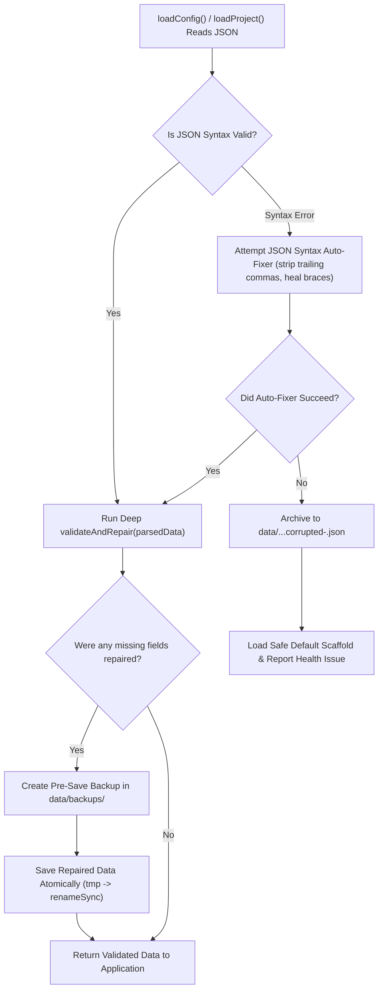

# Plan 12: Data Resilience, Deep Graceful Recovery & Backup Preservation

## Status: ✅ **COMPLETED**

---

## 1. Verification Checklist & Status Log

- [x] **Atomic File Persistence (`saveConfig`, `saveProject`)**:
  - Implement atomic write pattern: serialize data to a temporary swap file (`data/.<filename>.tmp.<pid>.<timestamp>.<rand>`) and execute atomic rename (`fs.renameSync`) over `data/config.json` and `data/projects/<slug>/project.json`.
  - Guarantees zero partial file corruption during unexpected server restarts or process termination.
- [x] **Automated Rolling Backups (`data/backups/`)**:
  - Before overwriting `data/config.json` or any `data/projects/<slug>/project.json` during admin save operations or auto-repairs, generate a timestamped snapshot in `data/backups/config-<timestamp>.json` or `data/backups/project-<slug>-<timestamp>.json`.
  - Maintain a bounded rolling window (keeps latest 15 snapshots per target) and prunes older backups to prevent unbounded disk usage.
- [x] **Non-Destructive Corrupted File Archival (`archiveMalformedFile`)**:
  - If `fs.readFileSync` reads a file that fails `JSON.parse()`:
    - Attempt automated syntax repair (cleaning trailing commas, unbalanced braces/brackets, unclosed quotes, comments).
    - If automated parsing still fails: **NEVER overwrite the file with default data**.
    - Immediately copy/rename the corrupted file to `data/config.corrupted-<timestamp>.json` or `data/projects/<slug>/project.corrupted-<timestamp>.json`.
    - Only then initialize the fallback default scaffold so the application stays operational while preserving 100% of the raw user content for inspection/recovery.
- [x] **Deep Graceful Field Normalization & Defaulting (`validateAndRepairConfig`, `loadProject`)**:
  - **Global Config Root**: Check `adminAccess` (boolean), `adminPassword` (string), `devAccess` (boolean), `privateAccessCode` (string), `siteUrl` (string), `artist` (object).
  - **Artist Object**: Gracefully default `name`, `bio`, `links.platforms` (all standard platform keys), `links.socials` (all standard social keys). Convert null/undefined/number values to strings.
  - **Per-Project Metadata Isolation**:
    - Gracefully repair malformed project objects, missing project names, types, artists, dates.
    - Guarantee `visibility` defaults to `'public'` and `copyright` defaults to `'cleared'`.
    - Guarantee `tracks` is always an array of valid track objects.
    - Guarantee each track object contains sanitized `name` (string), `artist` (string), `links` (all platform keys initialized to string).
- [x] **Media & Slug Consistency Check**:
  - Ensure project slugs and track slugs are deterministic and sanitized (`slugify`).
  - Gracefully heal missing cover arts and broken relative audio paths without deleting valid user data.
- [x] **Verify Error Resilience**:
  - Test reading partially corrupted JSON (trailing commas, comments, missing closing braces) -> verified automatic syntax repair.
  - Test reading completely broken raw bytes -> verified creation of `.corrupted-<timestamp>.json` with zero data loss.

---

## 2. Executive Summary & Zero-Data-Loss Principle

User data is the single most valuable asset in the entire application. A corrupt file, interrupted write, or missing JSON field must **never** result in data loss or application crashes.

### The 4 Pillars of Data Safety:
1. **Atomic Writes**: Writes are completed to temporary swap files first and atomically swapped onto the destination.
2. **Rolling Snapshot Backups**: Pre-save backups guarantee rollback availability if an accidental delete or unwanted batch edit occurs.
3. **Graceful Schema Healing**: Missing or corrupt fields are repaired in memory with sensible defaults without wiping the surrounding project data.
4. **Corrupted File Quarantine**: Irreparable JSON files are preserved under timestamped archive names (`config.corrupted-<timestamp>.json` / `project.corrupted-<timestamp>.json`) before generating a clean working state.

---

## 3. Architecture & Recovery Pipeline



---

## 4. Technical Specification & Implementation Plan

### A. Non-Destructive Corrupted File Archival & Syntax Healing: [`lib/artistData.js`](file:///c:/Users/Dan/App%20Dev/artist-discography/artist-discography/lib/artistData.js)

```javascript
/**
 * Safely archives a malformed JSON file before creating a clean working copy.
 */
function archiveMalformedFile(filePath, rawContent) {
  try {
    const dataDir = path.dirname(filePath)
    const timestamp = new Date().toISOString().replace(/[:.]/g, '-')
    const corruptedPath = path.join(dataDir, `artist-data.corrupted-${timestamp}.json`)
    fs.writeFileSync(corruptedPath, rawContent, 'utf8')
    console.error(`CRITICAL: Malformed artist-data.json archived to ${corruptedPath}`)
    return corruptedPath
  } catch (err) {
    console.error('Failed to archive corrupted file:', err)
    return null
  }
}

/**
 * Attempts heuristic syntax repairs on corrupted JSON strings.
 */
function tryHeuristicJsonRepair(raw) {
  if (typeof raw !== 'string') return null
  let text = raw.trim()

  // 1. Remove JavaScript-style comments
  text = text.replace(/\/\*[\s\S]*?\*\/|([^:]|^)\/\/.*$/gm, '$1')

  // 2. Remove trailing commas before } or ]
  text = text.replace(/,(\s*[}\]])/g, '$1')

  // 3. Fix missing closing brackets/braces
  const openBraces = (text.match(/\{/g) || []).length
  const closeBraces = (text.match(/\}/g) || []).length
  const openBrackets = (text.match(/\[/g) || []).length
  const closeBrackets = (text.match(/\]/g) || []).length

  if (openBrackets > closeBrackets) {
    text += ']'.repeat(openBrackets - closeBrackets)
  }
  if (openBraces > closeBraces) {
    text += '}'.repeat(openBraces - closeBraces)
  }

  try {
    return JSON.parse(text)
  } catch {
    return null
  }
}
```

### B. Atomic Write Engine & Rolling Backups: [`lib/artistData.js`](file:///c:/Users/Dan/App%20Dev/artist-discography/artist-discography/lib/artistData.js)

```javascript
const MAX_BACKUPS_TO_KEEP = 15

/**
 * Creates a rolling timestamped snapshot in data/backups/
 */
function createRollingBackup(sourceFilePath) {
  try {
    if (!fs.existsSync(sourceFilePath)) return

    const dataDir = path.dirname(sourceFilePath)
    const backupsDir = path.join(dataDir, 'backups')
    if (!fs.existsSync(backupsDir)) {
      fs.mkdirSync(backupsDir, { recursive: true })
    }

    const timestamp = new Date().toISOString().replace(/[:.]/g, '-')
    const backupFile = path.join(backupsDir, `artist-data-${timestamp}.json`)
    fs.copyFileSync(sourceFilePath, backupFile)

    // Prune older backups
    const existingBackups = fs.readdirSync(backupsDir)
      .filter(f => f.startsWith('artist-data-') && f.endsWith('.json'))
      .map(f => ({ name: f, time: fs.statSync(path.join(backupsDir, f)).mtimeMs }))
      .sort((a, b) => b.time - a.time)

    if (existingBackups.length > MAX_BACKUPS_TO_KEEP) {
      for (const oldBackup of existingBackups.slice(MAX_BACKUPS_TO_KEEP)) {
        try {
          fs.unlinkSync(path.join(backupsDir, oldBackup.name))
        } catch {}
      }
    }
  } catch (err) {
    console.warn('Warning: Failed to create rolling backup:', err)
  }
}

/**
 * Atomically writes data to disk using a swap file.
 */
export function saveArtistData(data) {
  const filePath = getArtistDataFilePath()
  const dataDir = path.dirname(filePath)

  try {
    if (!fs.existsSync(dataDir)) {
      fs.mkdirSync(dataDir, { recursive: true })
    }

    // Step 1: Create snapshot backup of existing data
    createRollingBackup(filePath)

    // Step 2: Validate and sanitize structure before serialization
    const issues = []
    const { data: sanitizedData } = ArtistDataManager.validateAndRepair(data, issues)

    // Step 3: Write to temporary file in same filesystem
    const tempFilePath = `${filePath}.tmp.${Date.now()}.${Math.random().toString(36).substring(2, 8)}`
    const jsonString = JSON.stringify(sanitizedData, null, 2)
    
    fs.writeFileSync(tempFilePath, jsonString, 'utf8')

    // Step 4: Atomic rename over destination file
    fs.renameSync(tempFilePath, filePath)

    return {
      success: true,
      issues,
    }
  } catch (err) {
    console.error('Fatal error in saveArtistData:', err)
    return {
      success: false,
      error: err.message,
    }
  }
}
```

---

## 5. Edge Cases & Safeguards

1. **Concurrent Admin Saves**: Unique process IDs / random suffixes in temporary file names prevent collisions between overlapping save requests.
2. **Drive Out of Space**: Write to `.tmp` will fail cleanly without truncating the existing valid `artist-data.json`.
3. **Accidental Deletions**: Rollback snapshots in `data/backups/` ensure any deleted track or project can be recovered instantly.
